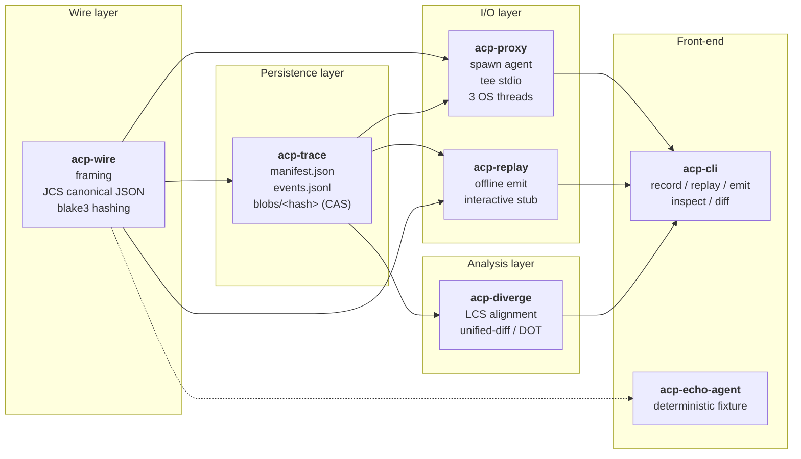
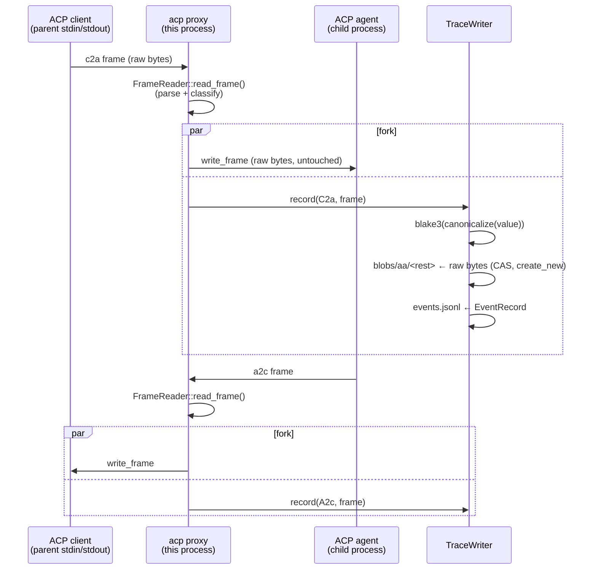
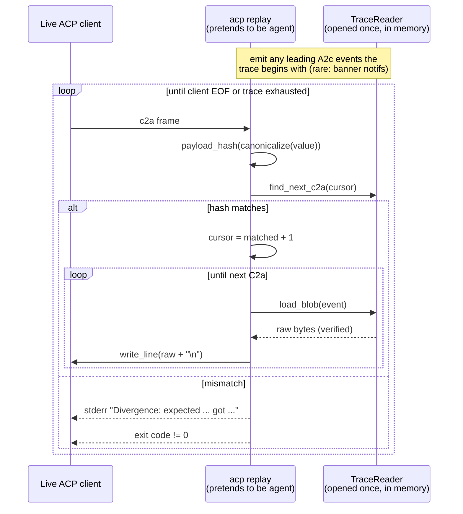

# Architecture

`acp-core` is a workspace of five library crates plus one CLI/agent
crate. The libraries form a layered stack: each lower layer is usable
on its own, and each higher layer adds one orthogonal capability.



## Data flow during `acp record`



Three OS threads do the work: `parent_stdin → child_stdin`,
`child_stdout → parent_stdout`, and a passive `child_stderr →
parent_stderr` forwarder. No `tokio`, no `select!`, no `Pin<Box<dyn
Future>>` — for a stdio MITM this is genuinely the simplest correct
shape.

## Data flow during `acp replay` (interactive)



The trace's `events.jsonl` is the **schedule**; the trace's `blobs/`
are the **bytes**. Hashes are used for matching (so the client may
permute keys); raw bytes are used for emission (so the wire stream is
byte-exact).

## Canonical hash vs. raw bytes — the key invariant

This split is the single decision that makes the whole project work:

| | source of truth | used for |
|---|---|---|
| `EventRecord.hash` | blake3 of RFC 8785 canonical form of the JSON value | matching, dedup across subagents, divergence analysis |
| `blobs/<hash>` | the original frame bytes, verbatim, no trailing newline | byte-exact replay of agent-to-client traffic |

Consequence 1: a client may send
`{"jsonrpc":"2.0","method":"x","id":1}` or
`{"id":1,"method":"x","jsonrpc":"2.0"}` — both hash identically, both
match the same recorded c2a event.

Consequence 2: the agent's outputs are *never regenerated* during
replay; the engine just reads them from the blob store. So a recorded
session produced by an LLM-backed agent at $0.20/prompt can be replayed
indefinitely at zero cost.

Consequence 3: the same blob is stored exactly once, no matter how
many times the session sees it. In an 8-way Grok-Build worktree fan-out
where every subagent saw the same `initialize` envelope, that envelope
exists once on disk.

## Trace directory layout

```
session/
  manifest.json          recorder, agent argv, RecordingEnv,
                         start/end time, event count, events_hash
  events.jsonl           one EventRecord per line, append-only
  blobs/
    aa/<rest>            raw frame bytes, filename = blake3 hex of
                         canonical form (sharded by first 2 hex chars
                         to keep any single directory < 65536 entries)
    ab/<rest>
    ...
```

`events.jsonl` is fsynced after every record so a crashed recording is
still inspectable; `manifest.json` is written once at create-time with
`ended_at = None`, then re-written on `finalize()` with end time,
event count, and a `blake3:` hash of the `events.jsonl` for tamper
detection.

## Divergence analysis

Two traces reduce to two sequences of `Step { direction, hash }`. We
compute the longest common subsequence with the standard O(n·m) DP,
then backtrack to produce a `Vec<DiffOp>` of `Common | OnlyA | OnlyB`
ops. The renderers (`render_unified`, `render_dot`) consume that.

For session sizes ACP agents realistically produce (low thousands of
frames), the O(n·m) memory is fine. If you ever need to compare two
multi-million-frame traces, swap in Hunt–McIlroy or Myers' diff —
the `DiffReport` data type is independent of how it was produced.

## Why no `tokio`?

The whole project does exactly four things that touch the OS:

1. spawn a child and inherit its three pipes,
2. read newline-delimited frames from a `BufRead`,
3. write `Vec<u8>` to a `Write`,
4. open / write files.

`std::process::Command`, `std::io::{BufReader, BufWriter}`, and
`std::thread::spawn` handle all four with no async runtime, no
`Pin<Box<dyn Future + Send>>`, and no `Arc<Mutex<…>>` that wouldn't be
there anyway. The proxy uses three OS threads (`c2a`, `a2c`, `stderr`)
which is the minimum to move bytes in both directions without
deadlocking on pipe buffer pressure. This keeps the dependency tree
small, the binary small, and panics easy to diagnose.
